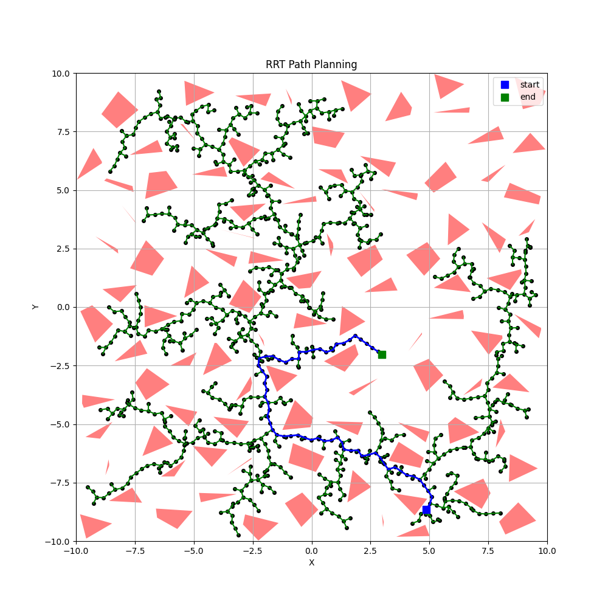

# Rapid Exploring Random Tree Path Planner

## Description
This project implements the Rapidly-exploring Random Tree (RRT) algorithm for path planning in Python. The RRT algorithm is a highly efficient, probabilistic path planning algorithm that is well-suited for navigating complex spaces with obstacles. It works by incrementally building a space-filling tree that rapidly explores the available space, aiming to find a feasible path from a start point to an end point while avoiding obstacles.

## Usage
To use this RRT path planning project, execute the `main.py` script from the command line:

```bash
python main.py
```


This script sets up a sample environment with bounds and obstacles, then runs the RRT algorithm to find a path from a start point to an end point. The script parameters can be adjusted within the `main.py` file to customize the environment and algorithm behavior.

### Example Use Cases
- **Robot Navigation**: Simulating path planning for a robot in a predefined area with obstacles.
- **Game Development**: Implementing AI pathfinding in complex game environments.

## Features
- **Rapid Exploration**: Efficiently explores the available space to find a feasible path.
- **Customizable Environment**: Allows customization of the search area bounds and obstacle characteristics.
- **Visualization**: Includes functionality to visualize the generated path and obstacle map.
- **Flexible Parameters**: Parameters such as goal sampling rate, extend length, and maximum iterations can be adjusted.

## Screenshots

